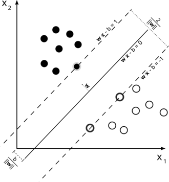

##摘要

描述这篇文章写什么

##原理简介

###SVM基本原理

测试图片




####模型
####求解
####例子

##源码实现
###代码结构
###实现

测试贴代码

```scala

@Since("1.3.0")
object SVMModel extends Loader[SVMModel] {

  @Since("1.3.0")
  override def load(sc: SparkContext, path: String): SVMModel = {
    val (loadedClassName, version, metadata) = Loader.loadMetadata(sc, path)
    // Hard-code class name string in case it changes in the future
    val classNameV1_0 = "org.apache.spark.mllib.classification.SVMModel"
    (loadedClassName, version) match {
      case (className, "1.0") if className == classNameV1_0 =>
        val (numFeatures, numClasses) = ClassificationModel.getNumFeaturesClasses(metadata)
        val data = GLMClassificationModel.SaveLoadV1_0.loadData(sc, path, classNameV1_0)
        val model = new SVMModel(data.weights, data.intercept)
        assert(model.weights.size == numFeatures, s"SVMModel.load with numFeatures=$numFeatures" +
          s" was given non-matching weights vector of size ${model.weights.size}")
        assert(numClasses == 2,
          s"SVMModel.load was given numClasses=$numClasses but only supports 2 classes")
        data.threshold match {
          case Some(t) => model.setThreshold(t)
          case None => model.clearThreshold()
        }
        model
      case _ => throw new Exception(
        s"SVMModel.load did not recognize model with (className, format version):" +
        s"($loadedClassName, $version).  Supported:\n" +
        s"  ($classNameV1_0, 1.0)")
    }
  }
}

```

###测试

##实战总结
###环境搭建
###常见问题
###性能比较、参数优化

##参考资料


